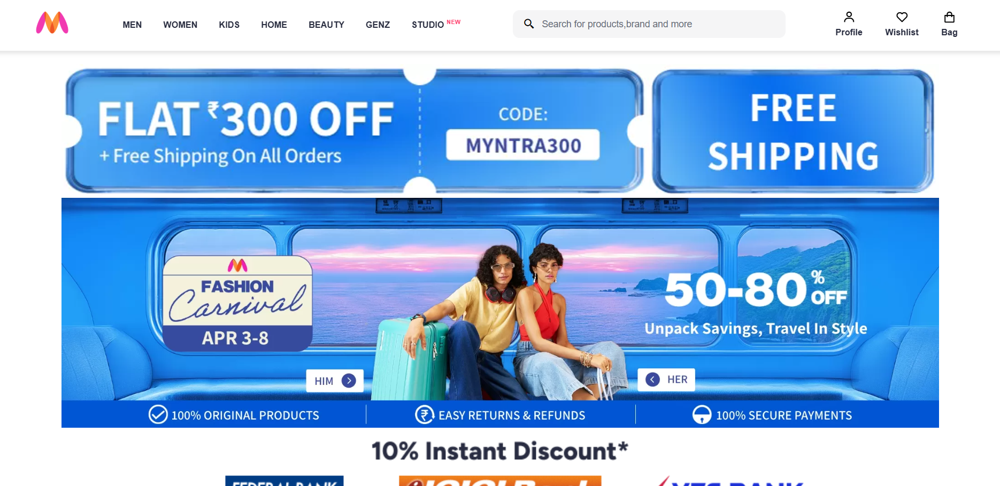
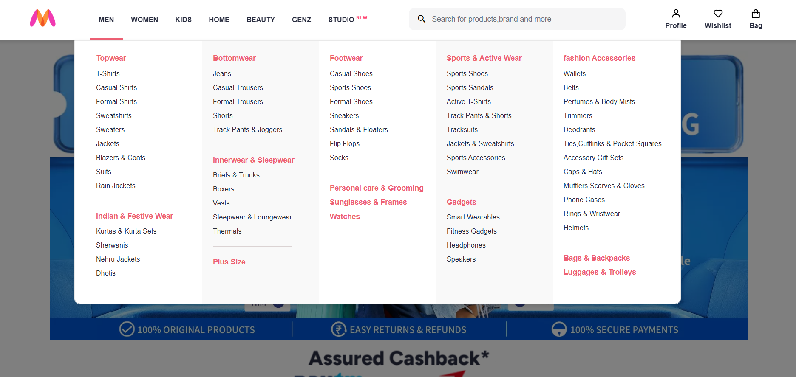
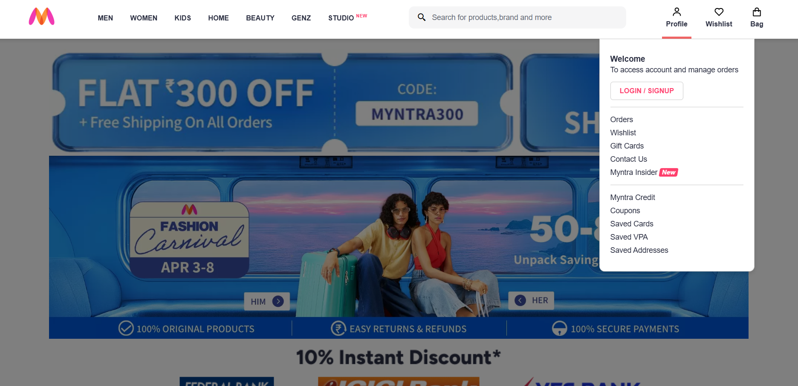

# 🛍️ Myntra Clone

A responsive front-end clone of the popular e-commerce fashion website Myntra. This project replicates the user interface and core visual features of the Myntra shopping experience.

## ✨ Features

- Responsive design that works across desktop and mobile devices
- Interactive navigation menus with dropdown categories
- Product catalog display
- Visually accurate recreation of Myntra's branding and UI

## 🛠️ Technologies Used


## 📁 Project Structure

```
myntra-clone/
├── css/
│   ├── style.css       # Global styles
│   ├── header.css      # Header styling
│   ├── main.css        # Main content styling
│   ├── footer.css      # Footer styling
├── js/
│   ├── header.js       # Header functionality
├── images/             # Project images and assets
└── index.html          # Main HTML file
```

## 🚀 Getting Started

### Prerequisites

- A modern web browser (Chrome, Firefox, Safari, Edge)

### Installation

1. Clone the repository:
   ```
   git clone https://github.com/Tushar-revankar/Myntra-clone.git
   ```

2. Open the project folder:
   ```
   cd myntra-clone
   ```

3. Open `index.html` in your browser to view the website.

## 📸 Screenshots

### Homepage


### Dropdown


### User profile
